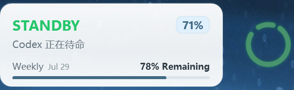

# Agent Halo

`v0.16.5` · English | [简体中文](README.zh-CN.md)



A desktop halo showing coding agent activity. Windows supports Codex and DeepSeek Harness (DSH); the macOS development build supports Codex.

Based on [NePixe1/AgentHalo](https://github.com/NePixe1/AgentHalo), under the [MIT License](LICENSE).

## Features

- Codex task status, context usage, model, and current-turn tokens. Official OAuth mode also shows available 5-hour and weekly quotas.
- DSH task status, task title, and main-agent model.
- Completion reminders last up to five minutes and yield to new activity. Prompts waiting for user action have no completion timeout.
- Dragging with edge snapping, always on top, pause, launch at login, and 75%, 100%, or 125% sizing.

## Use on Windows

Requires Windows 10/11 and .NET Framework 4.8. Extract `outputs/AgentHalo-Windows-v0.16.5.zip`, keep the files together, and run `AgentHalo.exe`. Hover for details; right-click to switch agents or change settings.

Codex is the default monitor. When a DSH desktop profile is first ready, Agent Halo registers its bundled observer and selects DSH. Later launches preserve your choice. See the [DSH integration guide](docs/DEEPSEEK_HARNESS_INTEGRATION.zh-CN.md) for setup and removal. Full monitoring of real DSH tasks has not yet been verified.

The package is unsigned, so SmartScreen may appear on first launch. The EXE checksum is in `SHA256.txt`.

## Build and check

Run from the repository root. On Windows, use PowerShell:

```powershell
powershell -ExecutionPolicy Bypass -File .\scripts\build-windows.ps1
.\outputs\AgentHalo\AgentHalo.exe --self-test .\outputs\self-test.txt
Get-Content .\outputs\self-test.txt
```

The build produces `outputs/AgentHalo/` and a ZIP alongside it. The self-test should report `PASS`.

On macOS, use macOS 13+ and Swift 6:

```bash
bash ./scripts/run-macos.sh --verify
```

Shared checks are in the [CI configuration](.github/workflows/ci.yml). State and animation details are documented for [Windows](docs/WINDOWS_VISUAL_BEHAVIOR.md) and [macOS](docs/MACOS_VISUAL_BEHAVIOR.md).

## Data access

Monitoring reads local logs or DSH plugin snapshots without uploading session content. The DSH plugin neither submits model requests nor collects conversation text. Official Codex quota refresh uses the existing OAuth login to contact official endpoints.
